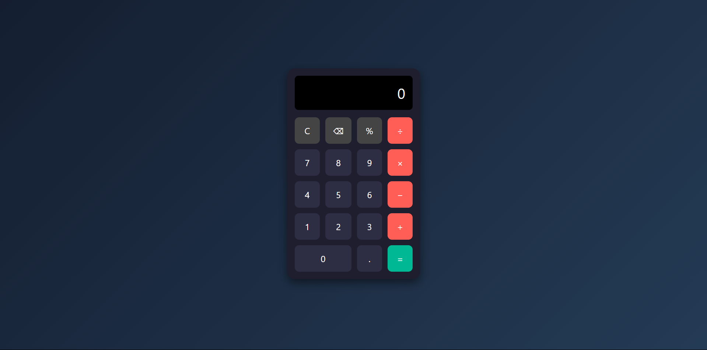
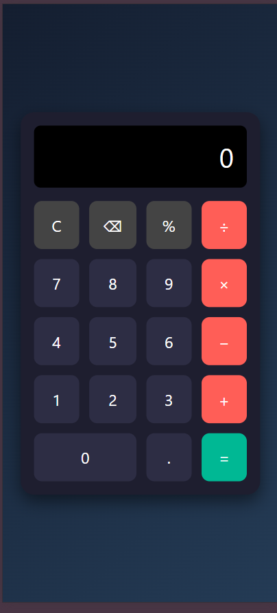

# 🧮 Modern Calculator - CodeAlpha Internship Task 2

This is a sleek, modern calculator built using **HTML, CSS, and JavaScript** as part of the **CodeAlpha Frontend Development Internship**.

## 🔥 Features
- Basic arithmetic operations: ➕ ➖ ✖️ ➗
- Real-time result display
- Keyboard support
- Smooth button transitions
- Responsive for all devices 📱💻
- Light animations + clean UI ✨

## 🚀 Live Demo
[🔗 View My Projects on GitHub](https://github.com/ShahnawazAhmed26?tab=repositories)

## 📁 Folder Structure:

CodeAlpha_Calculator/
│
├── index.html # Main UI
├── style.css # Styling & animation
├── script.js # Logic & interactivity
└── README.md # You're reading it 😉

## 📸 Screenshots
| Desktop View | Mobile View |
|--------------|-------------|
|  |  |

## 📽️ Video Explanation
Check out the full video demo + walkthrough here:  
[🔗 LinkedIn Post](https://www.linkedin.com/in/your-profile)

